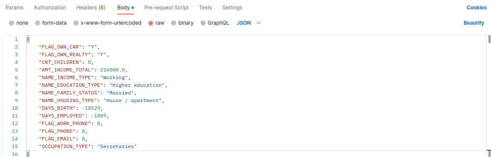
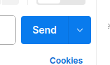
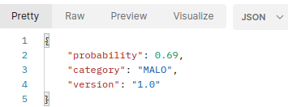
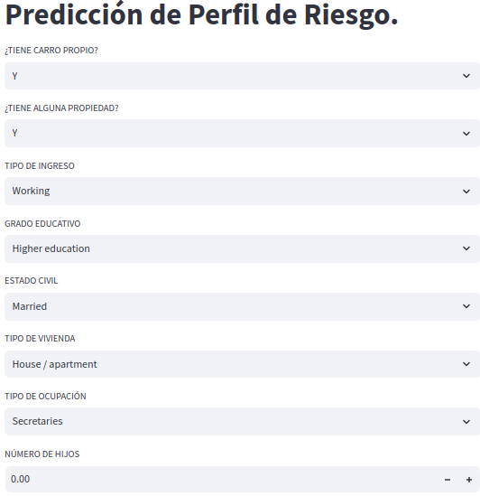
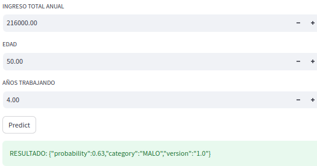

# __RISK MODEL__

## __1. OBJETIVO.__
Se predende ofrecer una herramienta de Ciencia de Datos que tenga como fin el
predecir el perfil crediticio de un potencial cliente al etiquetarlo como "BUENO" o "MALO".

Para alcanzar dicho fin, se ha desarrollado una API que, dada cierta información de la aplicación del cliente al producto de interés, es capaz de devolver dicha etiqueta con un grado de confianza razonable.

## __2. MPV ACTUAL.__
Ya se ha desarrollado una primera versión de la API. Es capaz de ofrecer una etiqueta de "BUENO" O "MALO". Tiene asociado un modelo de Machine Learning entrenado con ayuda del historial que se tiene de los clientes anteriores.

## __3. SOBRE EL REPOSITORIO EN GITHUB.__
La código desarrollado para la creación de la API se puede consultar [aquí](https://github.com/miguel-uicab/good_bad_applicant). El respositorio raíz se llama __good_bad_applicant__. 

Para la codificación se ha usado python versión `3.8.12`.

El repositorio contiene 7 carpetas. Cada carpeta contiene un archivo *requiriments.txt* que contiene las versiones de paqueterías necesarias. Se recomienda instalar estas paqueterías en ambientes aislados. También, cada carpeta cuenta con una serie de scripts en python auxiliares que son utilizados por los jupyter notebooks.

Las 7 carpetas son:
1. __data/:__ Contiene las datas csv originales.
2. __exploratory_and_preprocessing/:__ Contiene los archivos necesarios para la construcción de la variable objetivo, el análsis exploratorio de datos y preprocesamiento. El orden en que deben consultarse lo archivos notebooks es:
    1. *construction_target_variable.ipynb*: LLeva a cabo un Análisis de Cohorts con el fin de obtener una etiqueta de "BUENO" o "MALO".
    2. *exploring_preprocessing.ipynb*: Se lleva a cabo la exploración de la data y el preprocesamiento.
3. __outputs/:__ Contiene los archivos binarios resultantes de los procesos de preprocesamiento de data y ajuste final modelo. Además, contiene gráficos informativos en formato `html`. De entre todos los archivos, el binario contenedor del modelo de ML es `risk_model.sav`.
4. __training/:__ Contiene los archivos necesarios para el entrenamiento, optimización, y guardado del modelo. El orden en que deben ser consultados los archivos notebooks es:
    1. *model_selection.ipynb*: Realiza una pequeña competencia de estimadores.
    2. *model_optimization.ipynb*: Realiza la optimización del modelo ganador.
    3. *final_training.ipynb*: Realiza el ajuste y guardado del modelo optimizado.
    4. *shap_feature_importences.ipynb*: Utiliza la shap values para visualiar las importancias de las features después del ajuste del modelo ganador.
5. __app/:__ Contiene los archivos necesarios para poder despligar el modelo usando FastAPI.
6. __frontend/:__ Contiene los archivos necesarios para poder acceder a una visualización web que hace uso de la app usando Streamlit.
7. __images/:__ Contiene imagenes necesarias.

## __4. SOBRE EL PAYLOAD QUE CONSUME LA API.__
Se tiene como payload de entrada una estructura `json` de la siguiente forma
```
{
    "FLAG_OWN_CAR": "Y",
    "FLAG_OWN_REALTY": "Y",
    "CNT_CHILDREN": 0,
    "AMT_INCOME_TOTAL": 216000.0,
    "NAME_INCOME_TYPE": "Working",
    "NAME_EDUCATION_TYPE": "Higher education",
    "NAME_FAMILY_STATUS": "Married",
    "NAME_HOUSING_TYPE": "House / apartment",
    "DAYS_BIRTH": -18529,
    "DAYS_EMPLOYED": -1809,
    "FLAG_WORK_PHONE": 0,
    "FLAG_PHONE": 0,
    "FLAG_EMAIL": 0,
    "OCCUPATION_TYPE": "Secretaries"
}
```
Con base en esta información preliminar, la función de predicción asociada a la API replica los procesos realizados en el preprocesamiento, las transformaciones
y la ingeniería de características, con el fin de obtener la versión definitiva de las variables que son entradas del modelo de ML.

La salida que se espera es una estructura `json` de la forma 
```
{'probability': 0.63, 'category': 'MALO', 'version': '1.0'}
```
donde:
1. `probability`: Es la probabilidad de que el potencial cliente sea considerado como "MALO".
2. `category`: Categoría dependiente de la probabilidad. Si la probabilidad es mayor a 0.5, la categoría será 'MALO', en caso contrario, será 'BUENO'.
3. `version`: Es la versión del modelo.


## __5. USO DE LA APP.__

### Correr la app de manera local.
Para hacer uso de la app de manera local, se puede hacer desde la carpeta __app/:__ y correr el siguiente código:

```
python main.py
```

Para probarla, se puede hacer uso de Postman de la siguiente manera:
1. Ingresar el endpoint (`http://0.0.0.0:8000`) y seleccionar __POST__.


2. Seleccionar __Body__, luego __raw__ y luego __JSON__. Ingresar un ejemplo de payload (uno se exhibe en la sección 4.)



3. Seleccionar __SEND__.



Se debe esperar recibir una respuesta del estilo siguiente:



### Contenerización de la app.

Para construir una imagen usando docker, se puede correr lo siguiente:
```
docker build -t model_risk_app .   
```

Se puede correr la app, ahora ya en un contendor, usando lo siguiente:
```
docker run -p 8000:8000 model_risk_app 
```

## __6. PROTOTIPO DE LA APLICACIÓN WEB.__

### Para visualizar de manera local.
Para tener una idea del frontend que servirá la app, previo a que esta ya haya sido ejecutada (ver sección 5.), se puede correr una aplicación Streamlit de la siguiente manera.

```
streamlit run streamlit-app.py
```

Al hacerlo, se podrá ver un frontend como sigue:





### Contenerización de la app Streamlit.

Para construir una imagen usando docker, se puede correr lo siguiente:
```
docker build -t risk_model_streamlit_app . 
```

Se puede correr la app, ahora ya en un contendor, usando lo siguiente:
```
docker run -p 8501:8501 risk_model_streamlit_app
```

## __7. FUTURO DEL PROYECTO: DESPLIEGUE DE LA APLICACIÓN A PRODUCCIÓN Y MONITOREO.__

Queda pendiente la construcción de infraestructura necesaria para
asegurar la escalabilidad de la aplicación. Esta escalabilidad conlleva el despliegue del modelo en producción y su monitoreo.

En cuanto al monitoreo, se refiera a tener bajo vigilancia los cambios que se tienen en la distribución de los datos a través del tiempo (__drift__), tanto en las features como en la variable objetivo. Cualquier cambio significativo debe dar lugar a una revisión del modelo, para su actualización o sustitución, pues este cambio puede afectar negativamente el rendimiento del modelo en producción. Para hacer esto, se puede recurrir a herramientas como [evently](https://github.com/evidentlyai/evidently).

El despliegue en producción se puede hacer de manera rápida usando por ejemplo *AWS Elastic Beanstalk* para tener un endpoint que permita el consumo de la aplicación de manera general. *AWS Elastic Beanstalk* permite desplegar usando solo un archivo `.zip` que contiene la aplicación y sus requerimientos.

Sin embargo, para añadir procedimientos de CI/CD (integración y despliegue  continuos) habrá que recurrir a una combinación más sofisticada de herramientas que permitan el dinamismo y versionado necesarios. Esto se puede alcanzar usando, por ejemplo:
1. *Google Cloud Platform*: para guardar la imagen que permita la construcción del contenedor, correr la api y obtener un endpoint.
2. *GitHub Actions*: Para el entrenamiento continuo.
3. *DVC* (Data Version Control): Para guardar las diferentes versiones de la data de entrenamiento y del modelo que se tengan a lo largo del tiempo.
4. *CML* (Continuous Machine Learning): Para el monitoreo del modelo. 


