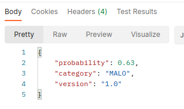

# __RISK MODEL__

## __1. OBJETIVO.__


## __2. MPV ACTUAL.__


## __3. SOBRE EL REPOSITORIO EN GITHUB.__
Se puede consultar [aquí](https://github.com/miguel-uicab/rain_in_australia). El respositorio raíz se llama __good_bad_applicant__. 

Para la codificación se ha usado python versión `3.8.12`.

El repositorio contiene 5 carpetas. Cada carpeta contiene un archivo *requiriments.txt* que contiene las versiones de paqueterías necesarias. Se recomienda instalar estas paqueterías en ambientes aislados.

Las 5 carpetas son:
1. __data/:__ Contiene un archivo con la data histórica necesaria para comenzar con el entrenamiento del modelo de machine learning.
2. __exploratory_and_preprocessing/:__ Contiene los archivos necesarios para el análsis exploratorio de datos y preprocesamiento.
3. __outputs/:__ Contiene los archivos binarios resultantes de los procesos de preprocesamiento de data y ajuste final modelo. Además, contiene gráficos informativos en formato `html`. De entre todos los archivos, el binario contenedor del modelo de ML es `rain_model.sav`.
4. __training/:__ Contiene los archivos necesarios para el entrenamiento, optimización, y guardado del modelo.
5. __prediction/:__ Contiene los archivos necesarios para poner en marcha la __*función de pronostico*__.
6. __app/:__ Contiene los archivos necesarios para poder usar la __*función de pronostico*__ a treavés de una app usando FastAPI.
7. __frontend/:__ Contiene los archivos necesarios para poder acceder a una visualización de la aplicación web que hace uso de la app usando Streamlit.
8. __images/:__ Contiene imagenes necesarias.


## __4. SOBRE EL MODELO DE MACHINE LEARNING.__


## __5. SOBRE LA FUNCIÓN DE PRONÓSTICO.__
La __*función de pronóstico*__ está contenida en el script `prediction.py` en la carpeta __prediction/__. Esta función tiene como payload de entrada una estructura `json` de la siguiente forma
```
{
    "FLAG_OWN_CAR": "Y",
    "FLAG_OWN_REALTY": "Y",
    "CNT_CHILDREN": 0,
    "AMT_INCOME_TOTAL": 216000.0,
    "NAME_INCOME_TYPE": "Working",
    "NAME_EDUCATION_TYPE": "Higher education",
    "NAME_FAMILY_STATUS": "Married",
    "NAME_HOUSING_TYPE": "House / apartment",
    "DAYS_BIRTH": -18529,
    "DAYS_EMPLOYED": -1809,
    "FLAG_WORK_PHONE": 0,
    "FLAG_PHONE": 0,
    "FLAG_EMAIL": 0,
    "OCCUPATION_TYPE": "Secretaries"
}
```
Con base en esta información preliminar, la función replica los procesos realizados en el preprocesamiento, las transformaciones
y la ingeniería de características, con el fin de obtener la lista definitiva de variables que son entradas del modelo de ML.

La salida de la función es una estructura `json` de la forma 
```
{'probability': 0.69, 'category': 'MALO', 'version': '1.0'}
```
donde:
1. `probability`: Es la probabilidad el aplicante sea considerado como "MALO".
2. `category`: Categoría dependiente de la probabilidad. Si la probabilidad es mayor a 0.5, la categoría será 'MALO', en caso contrario, será 'BUENO'.
3. `version`: Es la versión del modelo.


## __6. USO DE LA APP__

### Correr la app de manera local
Para hacer uso de la app de manera local, se puede hacer desde la carpeta __app/:__ y correr el siguiente código:

```
python main.py
```

Para probarla, puede hacer uso de postman de la siguiente manera:
1. Ingresar el endpoint (`http://0.0.0.0:8000`) y seleccionar __POST__.


2. Seleccionar __Body__, luego __raw__ y luego __JSON__. Ingresar un ejemplo de payload (uno se exhibe en la sección 5.)


3. Seleccionar __SEND__.


Se debe esperar recibir una respuesta del estilo siguiente:



### Contenerización de la app

Para construir una imagen usando docker, se puede correr lo siguiente:
```
docker build -t model_risk_app .   
```

Se puede correr la app, ahora ya en un contendor, usando lo siguiente:
```
docker run -p 8000:8000 model_risk_app 
```

## __7. PROTOTIPO DE LA APLICACIÓN WEB__

### Para visualizar de maner local
Para tener una idea del frontend que servirá la app, previo a que esta ya haya sido corrida (ver sección 6.), se puede corres una aplicación Streamlit de la sigueinte manera.

```
streamlit run streamlit-app.py
```

Al hacerlo, se podrá ver un frontend como sigue:


### Contenerización de la app Streamlit

Para construir una imagen usando docker, se puede correr lo siguiente:
```
docker build -t rain_in_australia_streamlit_app . 
```

Se puede correr la app, ahora ya en un contendor, usando lo siguiente:
```
docker run -p 8501:8501 rain_in_australia_streamlit_app
```

## __8. FUTURO DEL PROYECTO: DESPLIEGUE DE LA APLICACIÓN Y MONITOREO.__

Queda pendiente la construcción de infraestructura necesaria para llegar a cumplir a cabalidad el objetivo último del proyecto: la escalabilidad de la __*función de pronóstico*__. Esta escalabilidad conlleva el despliegue del modelo y su monitoreo.

En cuanto al monitoreo, se refiera a tener bajo vigilancia los cambios que se tienen en la distribución de los datos a través del tiempo (__drift__), tanto en las features como en la variable objetivo. Cualquier cambio significativo debe dar lugar a una revisión del modelo, para su actualización o sustitución, pues este cambio puede afectar negativamente el rendimiento del modelo en producción. Para hacer esto, se puede recurrir a herramientas como [evently](https://github.com/evidentlyai/evidently).

El despliegue se puede hacer de manera rápida usando por ejemplo *AWS Elastic Beanstalk* para tener un endpoint que permita el consumo de la aplicacón de manera general. *AWS Elastic Beanstalk* permite desplegar usando solo un archivo `.zip` que contiene la aplicación y sus requerimientos.

Sin embargo, para añadir procedimientos de CI/CD (integración y despliegue  continuos) habrá que recurrir a una combinación más sofisticada de herramientas que permitan el dinamismo y versionado necesarios. Esto se puede alcanzar usando, por ejemplo:
1. *Docker*: para construir un contenedor de la api.
2. *Google Cloud Platform*: para guardar la imagen que permita la construcción del contenedor, correr la api y obtener un endpoint.
3. *GitHub Actions*: Para el entrenamiento continuo.
4. *DVC* (Data Version Control): Para guardar las diferentes versiones de la data de entrenamiento y del modelo que se tengan a lo largo del tiempo.
5. *CML* (Continuous Machine Learning): Para el monitoreo del modelo. 


